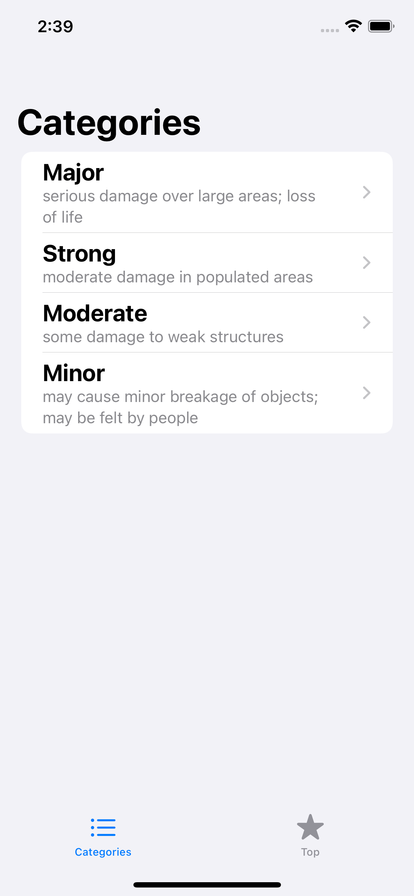
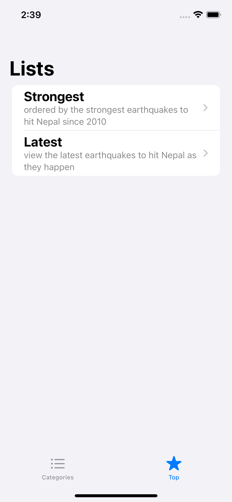
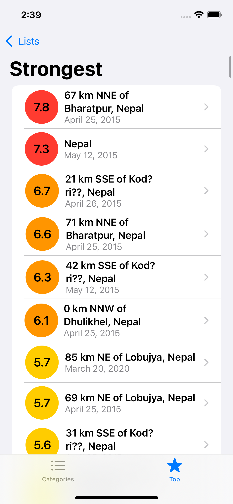
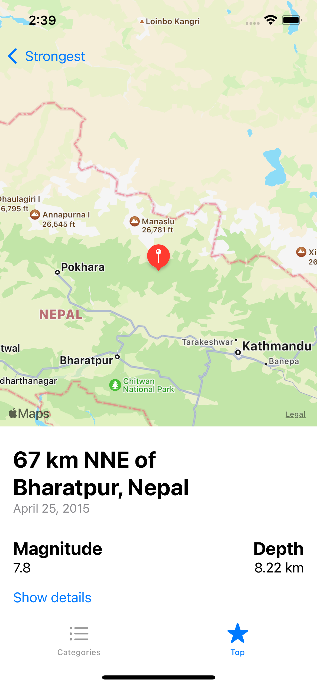

# NepalEarthquakesSwiftUI

This app gives you a list and details of earthquakes that occurred in Nepal. The data is fetched from an API provided by [The United States Geological Survey](https://earthquake.usgs.gov/fdsnws/event/1/) website. The data is displayed categorized by the strength of earthquakes or sorted by their magnitude or recency.

I wrote this app in order to try out **SwiftUI** and **Combine**. It closely follows the code and interface of the Landmarks app that is part of Apple's official [SwifUI tutorial](https://developer.apple.com/tutorials/swiftui).

|||||
|-|-|-|-|
